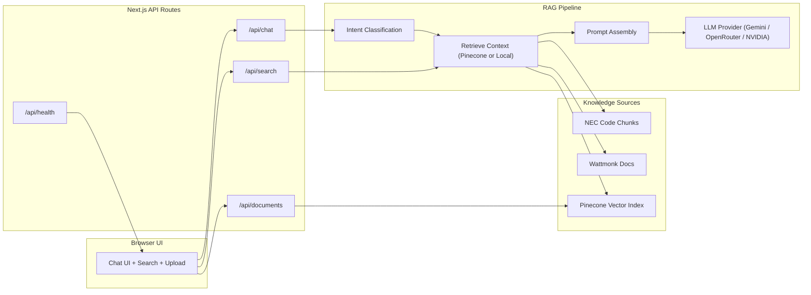

# RAG Chatbot Architecture

## System Overview



## Data Flow

1. **User input**
   - Message is submitted from UI.
   - Optional context: selected model/provider.

2. **Intent classification**
   - Keyword-based classifier assigns `nec`, `wattmonk`, or `general`.
   - Confidence score is computed.

3. **Retrieval**
   - If Pinecone enabled: query embeddings + vector search.
   - Otherwise: local fallback search (cosine similarity).

4. **Response generation**
   - System prompt + retrieved context are assembled.
   - Selected provider generates response.
   - Sources, confidence, and suggestions are returned.

5. **UI rendering**
   - Context badge, sources, and suggestions are displayed.
   - Conversation history maintained in-memory.

## Core Components

### Frontend

| Component | Purpose |
|-----------|---------|
| `ChatContainer` | Chat orchestration, input/output, suggestions |
| `ChatMessage` | Message rendering, sources, citations |
| `ChatInput` | User input box |
| `SearchPanel` | Knowledge-base search UI |
| `UploadPanel` | PDF upload into Pinecone |
| `ModelSelector` | Provider/model selection |
| `WelcomeScreen` | First-run guidance |

### Backend

| Module | Purpose |
|--------|---------|
| `context-detector.ts` | Intent classification |
| `embeddings.ts` | Retrieval logic + Pinecone fallback |
| `pinecone.ts` | Pinecone client + embeddings |
| `gemini.ts` | Provider selection + prompt assembly |
| `ai-provider.ts` | Gemini/OpenRouter/NVIDIA adapters |
| `document-processor.ts` | PDF extraction + chunking |

## API Endpoints

### `POST /api/chat`
Request:
```json
{
  "message": "What are the grounding requirements?",
  "history": [],
  "model": "deepseek-chat-v3-free"
}
```

Response:
```json
{
  "content": "According to NEC Article 250...",
  "context": "nec",
  "confidence": 0.95,
  "sources": [],
  "suggestions": []
}
```

### `GET /api/search?q=...`
Returns relevant documents from the knowledge base.

### `POST /api/documents`
Upload a PDF file and ingest into Pinecone.

### `GET /api/health`
Reports service configuration and basic status.

## Security Notes

- API keys are loaded via environment variables only.
- `.env` is ignored by git.
- Upload endpoint enforces PDF only.

## Performance Notes

- Retrieval defaults to local fallback if Pinecone is unavailable.
- Only last 10 messages are sent for context.
- UI uses lazy rendering of sources.
